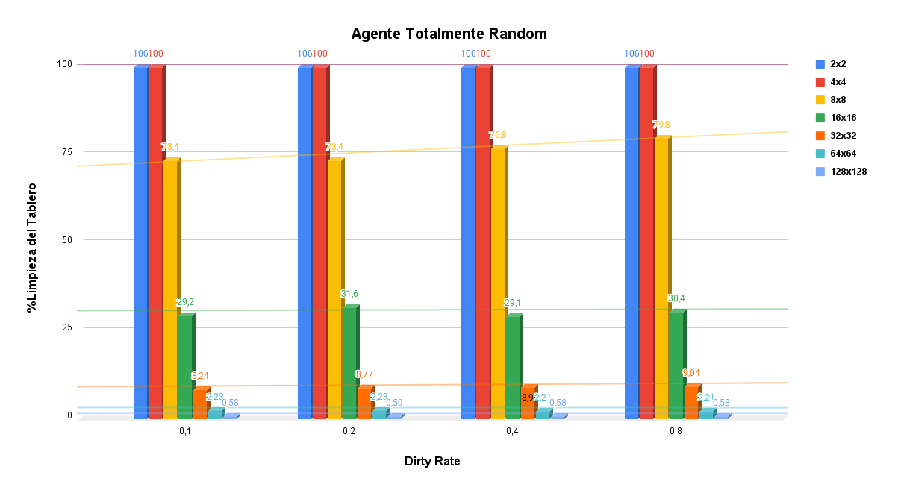

Reporte - Facundo Lella

A partir de experimentar con los dos Agentes, Reflexivo y Random en el entorno de la Aspiradora podemos sacar algunas conclusiones.

Los resultados obtenidos del agente reflexivo podemos ver en el grafico 
que a medida que aumentamos el tamaño del entorno y el dirty rate veremos un aumento de las acciones promedio de la aspiradora lo 
cual esto es totalmente logico mientras mas espacios y celdas sucias usaremos mas movimientos. Ahora viendo el grafico  vemos que el % de tablero que fueron capaz de limpiar, en los tamaños mas chicos fue excelente pero en los mas grandes vemos como se empieza a disminuir debido a lo grande del
tablero y la cantidad movimientos pero notamos que el rendimiento es muy parecido a pesar de aumentar el dirty rate.

Ahora viendo los graficos del agente totalmente random  y  podemos ver una clara disminucion de performance si lo comparamos con el agente reflexivo. Las acciones promedio de la aspiradores se 
elevaron demasiado en los peores casos un 400%. A pesar de tener resultados malos el agente totalmente random sigue siendo inteligente para el tamaño 2x2 y 4x4, pero en el grafico B2 podemos ver
como en los tamaños mas grandes se ve el mismo caso para el reflexivo, un porcentaje que parece disminuir o quedarse igual al aumentar el dirty rate.

Acceso a los datos del experimento: https://docs.google.com/spreadsheets/d/1GXULN3g5gLzDh0ihIYYh9Ct1qTjGLkgKDjTwIdrCc_k/edit?usp=sharing

