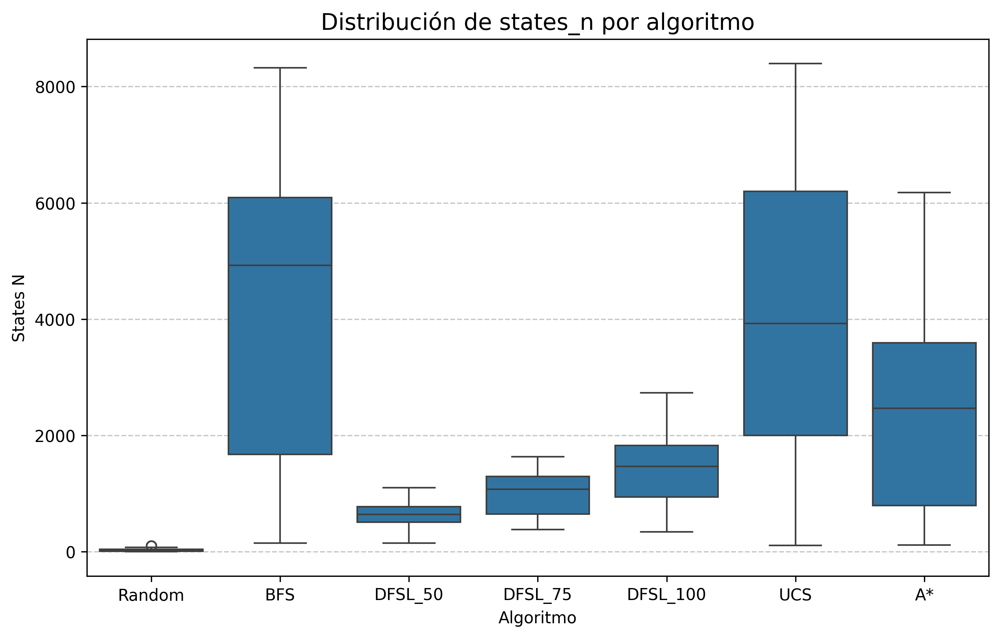
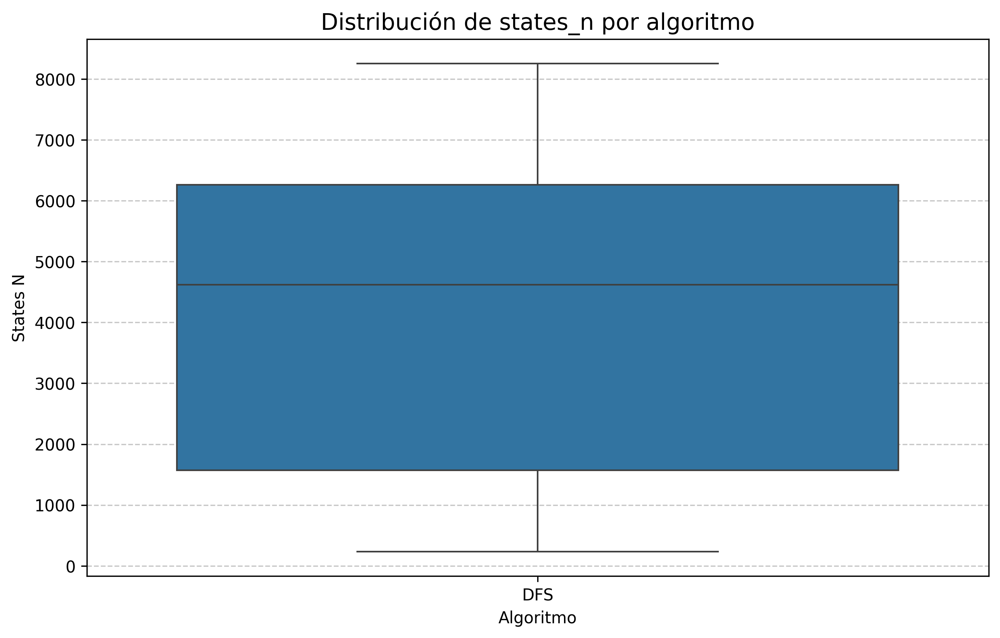
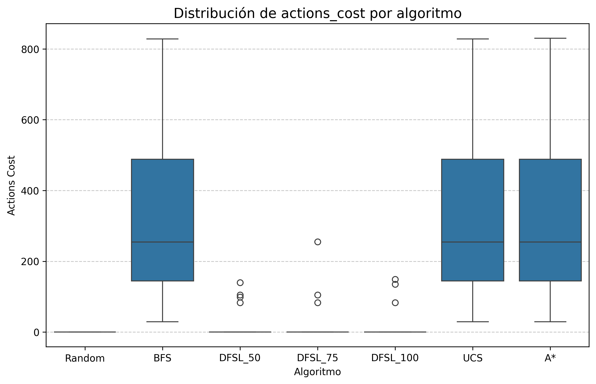
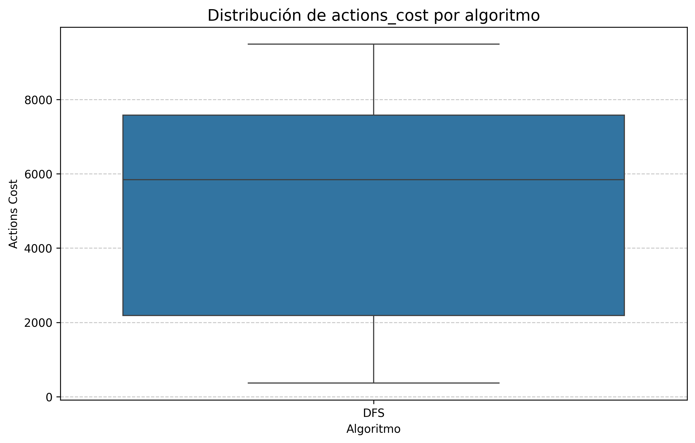
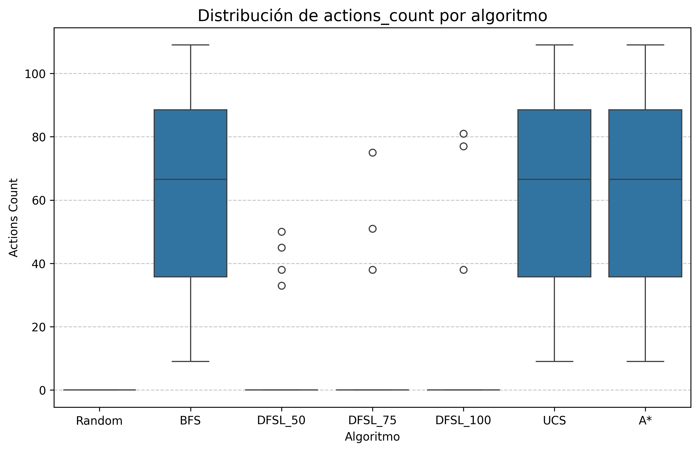
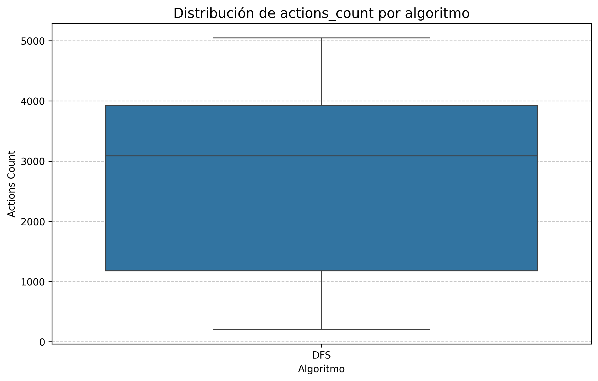
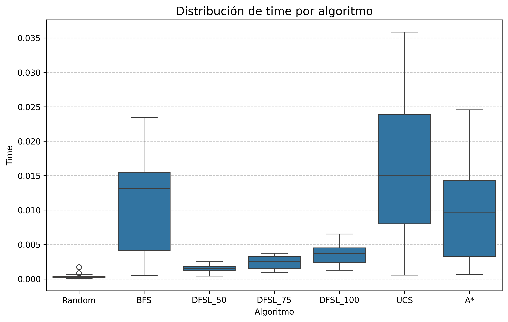
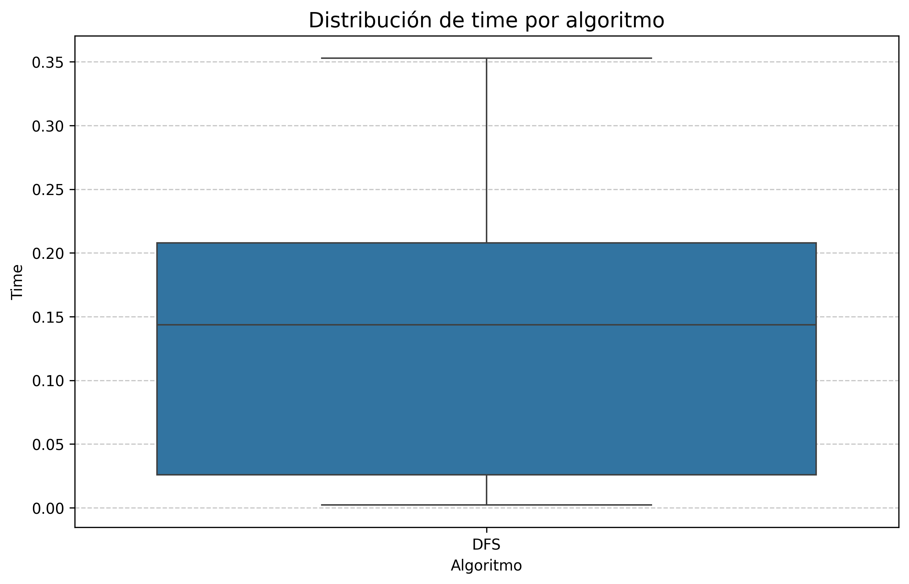

En este reporte hablare sobre los resultados obtenidos en las pruebas de los diferentes algoritmos de busqueda aplicados al entorno Frozen Lake (Random, BFS, DFS, DLS, UCS y A*(con una heuristica euclidiana)). Las caracteristicas del entorno fueron:
. Mapa Random (inicio y final random)
. Probabilidad de "Hold" 0.08
. Slippery = False
. Movimiento a la derecha o izquierda tiene un costo de 1
. Movimiento arriba o abajo tiene un costo de 10

Para la comparacion de la eficiencia de estos algoritmos he representado los datos con un grafico de cajas y extensiones (plotbox). El primero a analizar es el grafico de estados explorados por 
cada algoritmo.

Viendo los anteriores graficos podemos que el random es quien tiene menos movimientos pero esto ha causa de que explora poco, ya que tiene a caer en los agujeros y perder rapidamente. Si vemos
los algoritmos DLS vemos que sus estados explorados son menores debidos a su busqueda limitada pero no nos asegura que encuentre la solucion. Ahora viendo los algoritmos restantes vemos que estan
muy parecidos algunos mejores que otros, sin embargo hay uno que destaca mucho A* quien claramente es el ganador en esta estadistica, siendo el algoritmo que menos estados recorre.

Siguiendo con la comparacion veremos ahora los graficos del costo para llegar a la meta.

De estos graficos podemos ver que random tiene un costo de 0, ya que en las 30 pruebas hechas nunca encontro el camino por lo tanto recorrio 0. En los algoritmos DLS tuvieron algunos aciertos
sus valores estan mas o menos en el 50% de la distribucion de los demas algoritmos pero el resto de sus intentos fueron 0 por eso estan con un punto blanco que marca que son valores atipicos. Por
los algoritmos que nos aseguran un camino tienen un rendimiento igual excepto el DFS, al tener las mismas seeds y encontrar el mismo camino sus costos son iguales pero DFS que encuentra un camino pero no el mas
eficiente tiene un costo muy elevado. Aqui es un empate.

Las siguientes graficar a analizar son la cantidad movimientos o estados para llegar a la meta.

Si vemos parcialmente vemos que el random y DLS son los mas pequeños pero pueden que no esten llegando a la meta por lo tanto quedan un poco fuera de la estadistica. Si vemos los otros notamos que 
los algoritmos que tienen la solucion mas eficiente recorrieron los mismos pasos y sus distribuciones son iguales, debido a que sus seed son iguales todos encontraron el camino mas eficiente hacia la meta, y el 
DFS bueno encontro el camino pero mucho mas largo.

Finalizando los graficos de tiempo de ejecucion, si bien es algo cantado analizaremos un poco.

Como era de esperarse, los algoritmos random y dls se ven afectados por la cantidad de veces que no recorriendo nada es decir time de 0. Los algoritmos con un camino seguro vemos quienes encontraron el camino mas rapido 
se calculo desde que buscan el camino hasta que termina llegando a la meta, otra vez A* debido a que recorrio menos estados para encontrar el camino lidero esta estadistica.

Respondiendo a la pregunta del tp3:
4. ¿Cuál de los algoritmos considera más adecuado para resolver el problema planteado? Justificar
la respuesta.

  Por lo visto en las pruebas A* es un claro ganador, menor tiempo de ejecucion y cantidad de estados recorridos, su eficiencia fue superior a los demas.
  

