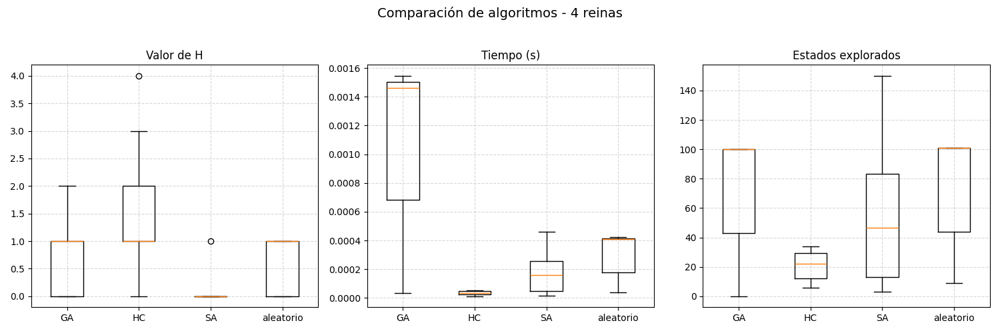
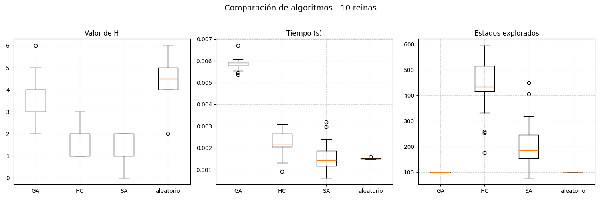
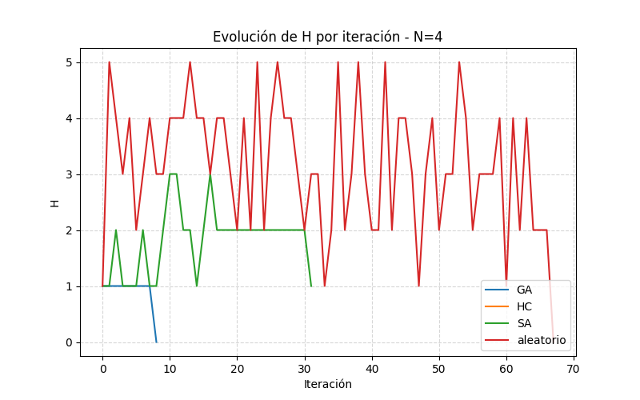
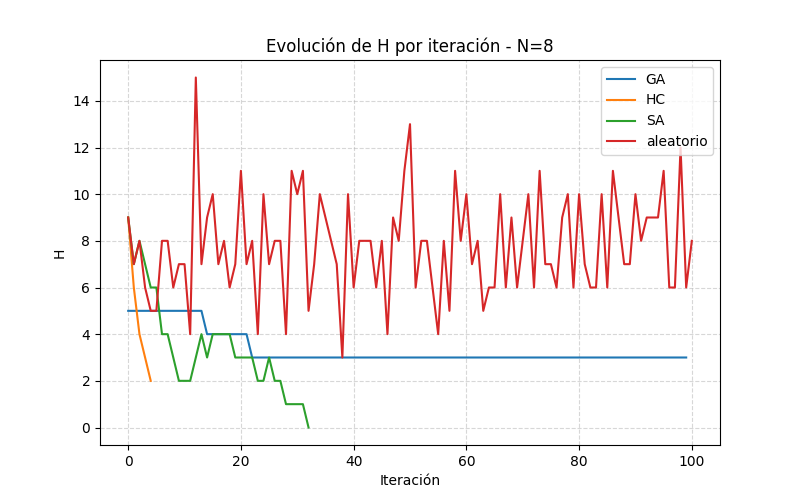

Resultados del Trabajo Practico N°4 - Busquedas Locales. Algoritmos utilizados
- Random
  
- SA = Simulated Annealing con 
  #CRITERIOS DE DETENCION:
  #Si encuentra una solucion (fitness = 0)
  #Si exploro mas de 1000 estados
  #Si rechazo 30 estados consecutivos
  
- HC = Hill Climbing Puro
  
- GA = Algoritmo Genetico (con estados incosistentes) con
  #ESTRATEGIA DE SELECCION: RANDOM
  #ESTRATEGIA DE REEMPLAZO: SI EL HIJO ES MEJOR QUE EL PEOR DE LA POBLACION, LO REEMPLAZA
  #OPERADORES: CRUZAMIENTO SIMPLE, MUTACION SIMPLE
  #CRITERIOS DE PARADA: SI ALGUN HIJO TIENE FITNESS 0, 100 GENERACIONES

Resultados: 
- Comparacion de promedio de estados explorados,fitness y tiempo

- Comparacion del trackeo de H.

Viendo los resultados nos damos cuenta que el claro ganador para estas pruebas es el Algoritmo de SA, mantuvo siempre un fitness entre 0 y 2. Quizas dandole mas generaciones a GA y sacando estados inconsistentes
pueda haber mas competencia.

