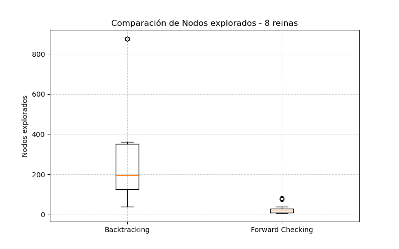
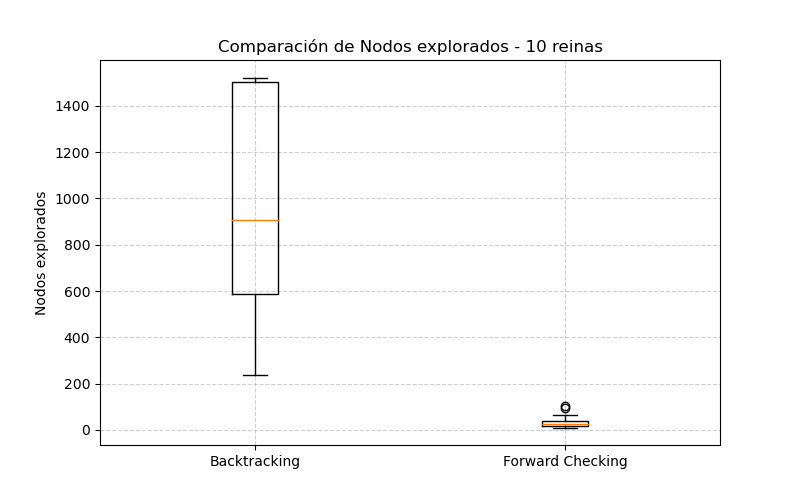
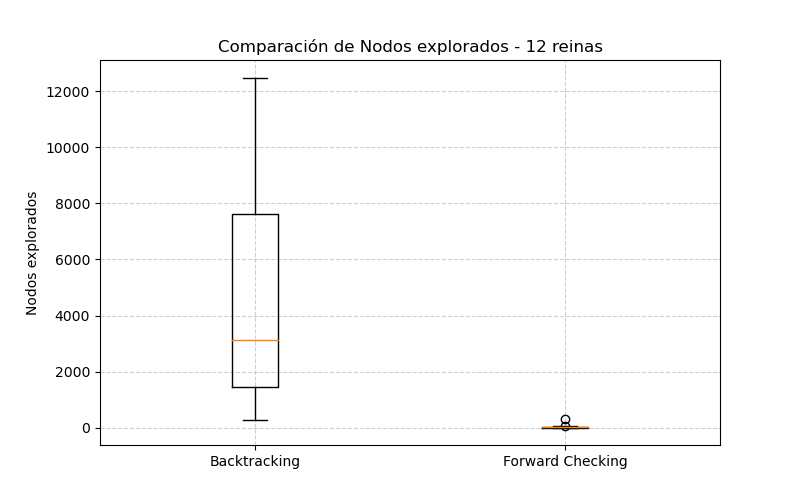
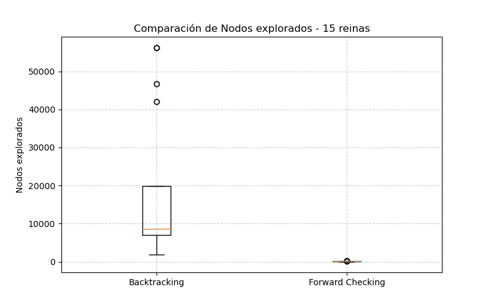

Reporte y Respuestas para el Trabajo Practico N°5 - CSP

1. Describir en detalle una formulación CSP para el Sudoku.
  Cada casilla del tablero es una variable. Si el tablero es de 9×9, hay 81 variables, que llamamos X_{r,c}, donde r es la fila (de 1 a 9) y c es la columna (de 1 a 9).
  Por ejemplo, X_{3,5} es la casilla que está en la fila 3, columna 5.
  El dominio de una variable son los valores que puede tomar. Si la casilla ya tiene un número en el Sudoku original, su dominio es ese número fijo.
  Por ejemplo, si X_{1,1} = 7, entonces Dom(X_{1,1}) = {7}. Si la casilla está vacía, puede tomar cualquier número del 1 al 9, es decir, Dom(X_{r,c}) = {1,2,3,4,5,6,7,8,9}.
  Las restricciones son las reglas del Sudoku. Hay tres tipos de reglas: en cada fila, los 9 números deben ser distintos; en cada columna, los 9 números deben ser distintos; y en cada bloque de 3×3 también deben estar todos los números del 1 al 9 sin repetir.
  En otras palabras, si dos casillas están en la misma fila, columna o bloque, no pueden tener el mismo valor.

2. Utilizar el algoritmo AC-3 para demostrar que la arco consistencia puede detectar la inconsisten-
cia de la asignación parcial WA=red, V=blue para el problema de colorear el mapa de Australia
(Figura 6.1 AIMA 3ra edición ).

3. ¿Cuál es la complejidad en el peor caso cuando se ejecuta AC-3 en un árbol estructurado CSP?
(i.e. cuando el grafo de restricciones forma un árbol: cualquiera dos variables están relacionadas
por a lo sumo un camino).

O(n⋅d2)

Razón:

En un árbol, entre cualquier par de variables hay a lo sumo un camino, es decir, no hay ciclos.
Esto significa que cuando hacemos AC-3, cada arco se revisa a lo sumo una vez por valor en el dominio.
Supongamos:
n = número de variables
d = tamaño máximo del dominio de cada variable
Cada revisión de un arco puede eliminar como máximo 
d−1 valores del dominio.
Dado que hay n-1 arcos en un árbol (porque un árbol con n nodos tiene n-1 arcos), y cada arco se revisa a lo sumo d veces por valor, el costo total es:
O((n-1)⋅d2) = O(n⋅d2)

4. Implementacion y analisis de resultados.
Algoritmos Utilizados:
- Backtracking (Selecciona random por donde empezar en el dominio, esto es para tener resultados distintos)
- Forward Checking (Utiliza la heuristica MRV con seleccion random en caso de haber un empate, igual que en bactracking esto es para tener resultados distintos)

Resultados:
- Comparacion Promedio de Estados Explorados.

- Comparacion en Tiempo Promedio.

_4reinas.png)

_8reinas.png)

_10reinas.png)

_12reinas.png)

_15reinas.png)

Analisis-

Viendo ambos algoritmos vemos que FC es superior gracias a su poda temprana y heuristica. Vemos que a medida que sube N backtracking se dispara, mientas que FC es mas estable.

Comparacion con los algoritmos del TP N°4 - (Random,Hill Climbing, Simulated Annealing,Algoritmo Genetico).

Si hacemos su comparacion vemos que los algoritmos CSP serian la mejor, nos ofrecen una efectividad del 100% en tiempos razonables y parecidos al de los otros algoritmos, ademas de que al aumentar 
el N a 10,12,15 para los otros algoritmos seguro sus resultados no hubieran sido lo mejor. Por esta razon para este problema usaria CSP.

