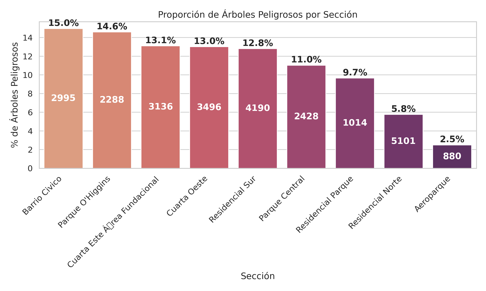
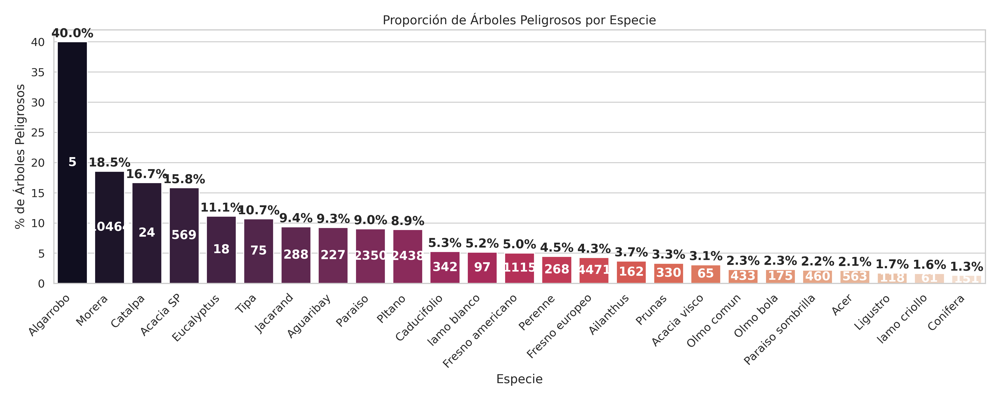

- ANALISIS EXPLORATORIO DE LOS DATOS - A partir de las preguntas hechas en el tp7B

a) ¿Cual es la distribucion de las clase inclinacion_peligrosa?

Como se puede observas hay muchos arboles no peligrosos a comparacion de peligrosos.

b) ¿Se puede considerar alguna seccion mas peligrosa que otra?
Para este grafico se uso proporciones, debido a que si una zona tiene muchos peligrosos pero tambien tiene muchos arboles produciria un sesgo, por lo tanto usamos proporciones.
Analizando vemos que en proporcion el barrio Civico, parque O'Higgins, Cuarta Este serian las zonas secciones mas peligrosas.

c) ¿Se puede considerar alguna especie mas peligrosa que otra?
Para el siguiente grafico tambien se usaron proporciones pero ahora podemos observar resultados que nos dicen poco, segun el grafico la especie algarrobo seria las mas 
peligrosa ya que de 5 arboles 2 son peligrosos representando el 40%, el siguiente son 10mil y casi el 20% son peligrosos pero los demas no son demasiados y tiene cifras similares
por estas razones no podria decir que hay una especie mas peligrosa que la otra.

- HISTROGRAMA DE FRECUENCIA PARA LA VARIABLE CIRC_TRONCO_CM
  

- HISTROGRAMA DE FRECUENCIA PARA LA VARIABLE INCLINACION_PELIGROSA
  

Se puede ver una clara tendencia a que mientras mayor el tamaño del tronco mas peligrosos.
Para la creacion del arbolado-mendoza-dataset-circ_tronco_cm-train.csv
Puntos de corte (según cuartiles de circ_tronco_cm):
bajo      ≤ 58.00
medio  > 58.00 y ≤ 110.00
alto   > 110.00 y ≤ 156.00
muy alto > 156.00

